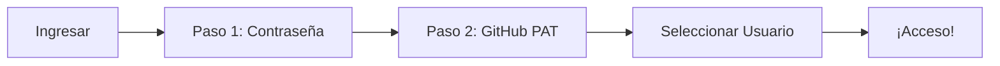

# 📚 Manual de Usuario - Molina Cerveza Artesanal

<div align="center">


**Sistema de Gestión para Cervecerías Artesanales**

*Versión 1.0 | Última actualización: Octubre 2025*

---

[🚀 Inicio Rápido](#-inicio-rápido) • [📖 Guía Completa](#-secciones-principales) • [🧮 Cálculos](#-cálculos-y-fórmulas) • [❓ FAQ](#-preguntas-frecuentes)

---

</div>

## 📋 Tabla de Contenidos

- [Introducción](#-introducción)
- [Inicio Rápido](#-inicio-rápido)
- [Autenticación](#-autenticación)
- [Secciones Principales](#-secciones-principales)
- [Cálculos y Fórmulas](#-cálculos-y-fórmulas)
- [Casos de Uso](#-casos-de-uso-prácticos)
- [Tips y Mejores Prácticas](#-tips-y-mejores-prácticas)
- [Preguntas Frecuentes](#-preguntas-frecuentes)

---

## 🎯 Introducción

### ¿Qué es Molina App?

**Molina** es un sistema completo de gestión diseñado específicamente para cervecerías artesanales. Te ayuda a:

- ✅ **Registrar** tu producción de cerveza
- ✅ **Controlar** tus finanzas (ingresos y gastos)
- ✅ **Calcular** el Costo Por Chela (CPC) de forma precisa
- ✅ **Visualizar** tu rendimiento con gráficas y KPIs
- ✅ **Sincronizar** todos tus datos en GitHub automáticamente

### ¿Por qué usar Molina?

| Beneficio | Descripción |
|-----------|-------------|
| 🎯 **Especializado** | Diseñado específicamente para cervecerías artesanales |
| 💾 **Seguro** | Todos tus datos respaldados en GitHub |
| 📊 **Analítico** | Dashboard con métricas clave y gráficas |
| 🌐 **Multi-dispositivo** | Accede desde cualquier navegador |
| 🔐 **Privado** | Tus datos solo en tu repositorio privado |

---

## 🚀 Inicio Rápido

### Paso 1: Acceder a la Aplicación

```
🌐 URL: https://dorianguzman.github.io/cerveza-molina/
```

### Paso 2: Autenticación (Primera Vez)

#### 2.1 Contraseña

<div style="background: #fff3cd; padding: 1rem; border-left: 4px solid #ffc107; margin: 1rem 0;">
<strong>📧 Contacta al administrador</strong> para obtener la contraseña de acceso
</div>

#### 2.2 GitHub Personal Access Token (PAT)

**¿Qué es un PAT?**
Un token que permite a Molina guardar tus datos en GitHub de forma segura.

**Cómo crear tu PAT:**

1. Ve a GitHub: https://github.com/settings/tokens/new
2. **Nombre:** `Molina Sync`
3. **Permisos:** Selecciona `repo` (acceso completo al repositorio)
4. **Clic en:** `Generate token`
5. **Copia** el token (solo se muestra una vez)

<div style="background: #f8d7da; padding: 1rem; border-left: 4px solid #dc3545; margin: 1rem 0;">
<strong>⚠️ Importante:</strong> Guarda tu token en un lugar seguro. No lo compartas con nadie.
</div>

#### 2.3 Seleccionar Usuario

Elige tu usuario de GitHub del menú desplegable:
- `dorianguzman`
- `FrdMolina`

### Paso 3: ¡Listo!

Una vez autenticado, verás el **Menú Principal** con todas las secciones disponibles.

---

## 🔐 Autenticación

### Sistema de Dos Pasos



### Seguridad

- 🔒 Contraseña encriptada con SHA-256
- 🔒 Token almacenado solo en sesión (no en localStorage)
- 🔒 Se borra automáticamente al cerrar el navegador

### Cerrar Sesión

Haz clic en el botón **Cerrar Sesión** en la esquina superior derecha.

---

## 📂 Secciones Principales

### 🏠 Menú Principal

Tu punto de partida. Desde aquí accedes a todas las funciones:

<table>
<tr>
<td width="25%" align="center">
<h4>📊 Tablero</h4>
Dashboard con KPIs y gráficas
</td>
<td width="25%" align="center">
<h4>📈 Estado PyG</h4>
Estado de Pérdidas y Ganancias
</td>
<td width="25%" align="center">
<h4>🍺 Producción</h4>
Registra lotes producidos
</td>
<td width="25%" align="center">
<h4>💰 Transacciones</h4>
Ingresos y gastos
</td>
</tr>
<tr>
<td width="25%" align="center">
<h4>💵 Ventas</h4>
Registra ventas de cerveza
</td>
<td width="25%" align="center">
<h4>⚙️ Configuración</h4>
Parámetros del sistema
</td>
<td width="25%" align="center">
<h4>📥 Importar</h4>
Importar datos desde JSON
</td>
<td width="25%" align="center">
<h4>📤 Exportar</h4>
Descargar respaldo
</td>
</tr>
</table>

---

### 📊 Tablero (Dashboard)

**¿Qué verás aquí?**

El dashboard muestra una vista completa de tu negocio con 4 secciones principales:

#### 1️⃣ Filtros de Período

```
┌─────────────────────────────────────┐
│  Mes: [Todos ▼]   Año: [2025 ▼]   │
│         [Actualizar]                │
└─────────────────────────────────────┘
```

- **Mes:** Filtra por un mes específico o ve todos
- **Año:** Selecciona el año a analizar

#### 2️⃣ KPIs Principales

<table>
<tr>
<th>KPI</th>
<th>Descripción</th>
<th>Color</th>
</tr>
<tr>
<td><strong>Ingresos Brutos</strong></td>
<td>Total de dinero que entró</td>
<td>Dorado</td>
</tr>
<tr>
<td><strong>Gastos Totales</strong></td>
<td>Suma de todos tus costos</td>
<td>Dorado</td>
</tr>
<tr>
<td><strong>Ganancia/Pérdida Neta</strong></td>
<td>Ingresos - Gastos</td>
<td>🟢 Verde (ganancia)<br>🔴 Rojo (pérdida)</td>
</tr>
<tr>
<td><strong>Chelas Producidas</strong></td>
<td>Total de pintas producidas</td>
<td>Dorado</td>
</tr>
</table>

#### 3️⃣ Costo por Chela y Precio Sugerido

```
┌────────────────────────────────────────┐
│  Costo Por Chela (CPC)  │  Precio Sugerido
│      $25.50 MXN          │    $40.80 MXN
│                           │  Con margen de 60%
└────────────────────────────────────────┘
```

**Interpretación:**
- **CPC:** Cuánto te cuesta producir una pinta
- **Precio Sugerido:** A cuánto deberías venderla (con 60% de ganancia)

#### 4️⃣ Gráficas Interactivas

**📈 Evolución de Ingresos y Gastos**
- Líneas que muestran cómo evolucionan mes a mes
- 🟢 Verde = Ingresos
- 🔴 Rojo = Gastos

**🍰 Desglose de Gastos**
- Gráfica de pastel mostrando en qué se va tu dinero
- Categorías: Ingredientes, Renta, Salarios, Servicios, etc.

---

### 📈 Estado de Pérdidas y Ganancias (PyG)

**Reporte detallado** de tu situación financiera:

```
┌─────────────────────────────────────────┐
│  ESTADO DE PÉRDIDAS Y GANANCIAS         │
│  Período: Enero 2025                    │
├─────────────────────────────────────────┤
│  INGRESOS                               │
│    Ventas de Cerveza        $45,000.00  │
│    Otros Ingresos            $2,000.00  │
│  ─────────────────────────────────────  │
│    Total Ingresos           $47,000.00  │
│                                          │
│  GASTOS                                 │
│    Ingredientes             $15,000.00  │
│    Renta                     $5,000.00  │
│    Salarios                  $8,000.00  │
│    Servicios                 $2,000.00  │
│    Otros                     $1,500.00  │
│  ─────────────────────────────────────  │
│    Total Gastos             $31,500.00  │
│                                          │
│  GANANCIA NETA              $15,500.00  │
└─────────────────────────────────────────┘
```

**¿Cómo leerlo?**
- 🟢 **Ganancia Neta positiva:** Estás generando ganancias ✅
- 🔴 **Ganancia Neta negativa:** Estás perdiendo dinero ⚠️

---

### 🍺 Producción

**Registra cada lote de cerveza que produces.**

#### Formulario

| Campo | Descripción | Ejemplo |
|-------|-------------|---------|
| **Fecha** | Cuándo se produjo | 2025-10-15 |
| **Nombre de la Cerveza** | Tipo/estilo | IPA Dorada |
| **Volumen (pintas)** | Cuántas pintas obtuviste | 50 |
| **Horas de Trabajo** | Tiempo dedicado | 8 |
| **Costo de Ingredientes** | Cuánto gastaste en ingredientes | $1,200 MXN |

#### Tabla de Producción

Verás todos tus lotes registrados con:
- 📅 Fecha
- 🍺 Nombre
- 📏 Volumen
- ⏱️ Horas
- 💵 Costo
- ✏️ Acciones (Editar/Eliminar)

<div style="background: #d1ecf1; padding: 1rem; border-left: 4px solid #0c5460; margin: 1rem 0;">
<strong>💡 Tip:</strong> Registra tus lotes inmediatamente después de producirlos para no olvidar detalles.
</div>

---

### 💰 Transacciones

**Todos tus ingresos y gastos que NO son de ventas de cerveza.**

#### Tipos de Transacciones

**📥 INGRESOS**
- Inversión inicial
- Préstamos recibidos
- Subsidios
- Otros ingresos

**📤 GASTOS**
```
├─ Ingredientes (malta, lúpulo, levadura)
├─ Renta
├─ Salarios
├─ Servicios (luz, agua, gas)
├─ Marketing
├─ Equipo
└─ Otros
```

#### Formulario

| Campo | Descripción | Ejemplo |
|-------|-------------|---------|
| **Fecha** | Cuándo ocurrió | 2025-10-01 |
| **Descripción** | Qué fue | Pago de renta octubre |
| **Monto** | Cantidad (siempre positivo) | 5000 |
| **Tipo** | Ingreso o Gasto | Gasto |
| **Categoría** | Clasificación | Renta |

<div style="background: #fff3cd; padding: 1rem; border-left: 4px solid #ffc107; margin: 1rem 0;">
<strong>⚠️ Importante:</strong> NO registres ventas de cerveza aquí. Usa la sección "Ventas" para eso.
</div>

#### Diferencia: Transacciones vs Ventas

| Aspecto | Transacciones | Ventas |
|---------|---------------|--------|
| **Qué son** | Gastos operativos e ingresos varios | Solo ventas de cerveza |
| **Ejemplos** | Renta, salarios, ingredientes | Venta de pintas/barriles |
| **Impacto en CPC** | ✅ Sí afecta | ❌ No afecta |
| **Categorías** | Múltiples | Solo ventas |

---

### 💵 Ventas

**Registra tus ingresos por venta de cerveza.**

#### Formulario

| Campo | Descripción | Ejemplo |
|-------|-------------|---------|
| **Fecha** | Cuándo vendiste | 2025-10-20 |
| **Ingresos Totales** | Cuánto dinero recibiste | $8,500 MXN |
| **Volumen Vendido** | Pintas vendidas | 120 |

#### Métricas Calculadas Automáticamente

```
Precio Promedio por Pinta = Ingresos / Volumen
Ejemplo: $8,500 / 120 pintas = $70.83 por pinta
```

<div style="background: #d1ecf1; padding: 1rem; border-left: 4px solid #0c5460; margin: 1rem 0;">
<strong>💡 Tip:</strong> Registra las ventas diarias o semanales para tener mejor control.
</div>

---

### ⚙️ Configuración

**Ajusta los parámetros del sistema.**

#### Parámetros Configurables

**1. Tarifa de Mano de Obra**

```
Valor por defecto: $150 MXN/hora
```

- Cuánto cuesta cada hora de trabajo en producción
- Incluye tu tiempo y el de tus ayudantes
- Se usa para calcular el costo de mano de obra

**2. Porcentaje de Margen de Ganancia**

```
Valor por defecto: 60%
```

- Qué porcentaje quieres ganar sobre el costo
- Define tu precio de venta sugerido
- Recomendaciones de la industria:

| Tipo de Negocio | Margen Sugerido |
|-----------------|-----------------|
| Solo distribución | 30-50% |
| Mixto (distribución + taproom) | 60-80% |
| Solo taproom | 100-200% |

**Fórmula:**
```
Precio Sugerido = CPC × (1 + Margen/100)

Ejemplo con 60% de margen:
CPC = $10
Precio Sugerido = $10 × (1 + 60/100) = $10 × 1.6 = $16
```

#### Almacenamiento de Datos

Ver información sobre dónde están guardados tus datos:

- ✓ Guardado automático en GitHub
- ✓ Acceso multi-dispositivo
- ✓ Backup seguro
- 📍 Repositorio configurado

---

### 📥 Importar Datos

**Importa datos desde un archivo JSON de respaldo.**

#### Pasos

1. Haz clic en la tarjeta **"Importar Datos"**
2. Selecciona tu archivo `.json`
3. Confirma la acción
4. ¡Listo! Los datos se cargarán a GitHub

<div style="background: #f8d7da; padding: 1rem; border-left: 4px solid #dc3545; margin: 1rem 0;">
<strong>⚠️ Advertencia:</strong> Importar datos sobrescribirá TODA la información actual en GitHub.
</div>

---

### 📤 Exportar Datos

**Descarga un respaldo completo de tus datos.**

#### Qué incluye

- ✅ Toda tu producción
- ✅ Todas las transacciones
- ✅ Todas las ventas
- ✅ Configuración

#### Formato

Archivo JSON con nombre:
```
molina_export_2025-10-26.json
```

<div style="background: #d1ecf1; padding: 1rem; border-left: 4px solid #0c5460; margin: 1rem 0;">
<strong>💡 Tip:</strong> Exporta tus datos regularmente como respaldo adicional.
</div>

---

## 🧮 Cálculos y Fórmulas

### Costo Por Chela (CPC)

**La métrica más importante** para fijar precios correctamente.

#### Fórmula Completa

```
CPC = (Costo Variable + Costo Fijo Amortizado + Costo Mano de Obra) / Total Chelas

Donde:

Costo Variable = Suma de ingredientes de todos los lotes

Costo Fijo Amortizado = Gastos fijos del período (renta, salarios, servicios)

Costo Mano de Obra = Horas totales × Tarifa por hora

Total Chelas = Pintas producidas en el período
```

#### Ejemplo Práctico

**Mes de Octubre 2025:**

```
📦 Producción:
   - 3 lotes de IPA Dorada
   - Total: 150 pintas
   - Ingredientes: $4,500 MXN
   - Horas trabajadas: 24 horas

💰 Gastos Fijos:
   - Renta: $5,000
   - Salarios: $8,000
   - Servicios: $2,000
   - Total: $15,000

⚙️ Configuración:
   - Tarifa de mano de obra: $150/hora

───────────────────────────────────

CÁLCULO:

1. Costo Variable = $4,500

2. Costo Fijo Amortizado = $15,000

3. Costo Mano de Obra = 24 horas × $150 = $3,600

4. Total Chelas = 150 pintas

5. CPC = ($4,500 + $15,000 + $3,600) / 150
       = $23,100 / 150
       = $154.00 por pinta

───────────────────────────────────

💰 PRECIO SUGERIDO (con 60% margen):
   = $154 × 1.6
   = $246.40 por pinta
```

### Ganancia o Pérdida Neta

```
Ganancia Neta = Total Ingresos - Total Gastos

Donde:

Total Ingresos = Ventas de Cerveza + Otros Ingresos

Total Gastos = Ingredientes + Renta + Salarios + Servicios + Otros
```

### Precio Promedio de Venta

```
Precio Promedio = Ingresos por Ventas / Volumen Vendido

Ejemplo:
$8,500 / 120 pintas = $70.83 por pinta
```

---

## 💼 Casos de Uso Prácticos

### Caso 1: Primera Semana de Operación

**Situación:** Acabas de empezar tu cervecería.

#### Día 1: Configuración Inicial

1. **Accede** a la aplicación
2. **Autentícate** con contraseña y GitHub PAT
3. Ve a **Configuración**
4. **Ajusta:**
   - Tarifa de mano de obra: según tu realidad
   - Margen de ganancia: según tu modelo de negocio

#### Día 2: Primera Producción

1. Ve a **Producción**
2. **Registra** tu primer lote:
   ```
   Fecha: 2025-10-15
   Nombre: IPA Dorada
   Volumen: 50 pintas
   Horas: 8
   Ingredientes: $1,200
   ```

#### Día 3: Registrar Gastos

1. Ve a **Transacciones**
2. **Registra** tus gastos iniciales:
   ```
   Renta del mes: $5,000 (Gasto - Renta)
   Compra de equipo: $15,000 (Gasto - Equipo)
   ```

#### Día 30: Primera Venta

1. Ve a **Ventas**
2. **Registra** tu primera venta:
   ```
   Fecha: 2025-11-14
   Ingresos: $3,500
   Volumen: 50 pintas
   ```

#### Análisis en Dashboard

1. Ve a **Tablero**
2. Revisa:
   - CPC de tu primera producción
   - Ganancia/Pérdida del mes
   - Gráficas de evolución

---

### Caso 2: Análisis Mensual

**Situación:** Quieres saber cómo te fue en septiembre.

#### Paso 1: Filtrar Dashboard

```
Mes: Septiembre
Año: 2025
[Actualizar]
```

#### Paso 2: Revisar KPIs

- ¿Tuviste ganancia o pérdida?
- ¿Cuánto produjiste?
- ¿Cuál fue tu CPC?

#### Paso 3: Analizar Gráficas

- **Ingresos vs Gastos:** ¿En qué momento del mes gastaste más?
- **Desglose de Gastos:** ¿Qué categoría consume más dinero?

#### Paso 4: Exportar Reporte

1. Ve a **Estado PyG**
2. Filtra por septiembre
3. Toma screenshot o imprime

---

### Caso 3: Ajustar Precios

**Situación:** Tus costos subieron y necesitas ajustar precios.

#### Paso 1: Actualizar Costos Reales

1. Ve a **Transacciones**
2. Registra los nuevos precios de ingredientes
3. Actualiza otros gastos si cambiaron

#### Paso 2: Revisar CPC Actual

1. Ve al **Tablero**
2. Observa el nuevo CPC
3. Compáralo con tu precio de venta actual

#### Paso 3: Ajustar Margen (Opcional)

1. Ve a **Configuración**
2. Si necesitas aumentar o reducir el margen, ajústalo
3. Ejemplo: de 60% a 70%

#### Paso 4: Calcular Nuevo Precio

```
Nuevo Precio = Nuevo CPC × (1 + Nuevo Margen/100)

Ejemplo:
CPC = $180
Margen = 70%
Precio = $180 × 1.7 = $306 por pinta
```

---

## 💡 Tips y Mejores Prácticas

### 🎯 Registro de Datos

| ✅ Hacer | ❌ Evitar |
|----------|-----------|
| Registrar producción inmediatamente | Esperar días/semanas para registrar |
| Ser preciso con las cantidades | Redondear o estimar mucho |
| Categorizar gastos correctamente | Usar "Otros" para todo |
| Revisar dashboard semanalmente | Solo revisar al final del mes |

### 📊 Análisis

```
RUTINA SEMANAL SUGERIDA:

Lunes:
  ✓ Registrar producción de la semana
  ✓ Registrar ventas de la semana

Martes:
  ✓ Registrar gastos e ingresos

Viernes:
  ✓ Revisar dashboard
  ✓ Analizar tendencias
  ✓ Ajustar si es necesario

Fin de mes:
  ✓ Exportar respaldo
  ✓ Generar reporte PyG
  ✓ Planificar siguiente mes
```

### 💰 Fijación de Precios

**Considera estos factores:**

1. **Tu CPC** (costo mínimo)
2. **Competencia** (precios del mercado)
3. **Valor percibido** (calidad de tu cerveza)
4. **Canal de venta:**
   - Taproom → Mayor margen (100-200%)
   - Distribución → Menor margen (30-50%)
   - Minorista → Margen medio (60-80%)

### 🔐 Seguridad y Respaldos

```
PLAN DE RESPALDO SUGERIDO:

Diario:
  ✓ Datos se guardan automáticamente en GitHub

Semanal:
  ✓ Exportar JSON local

Mensual:
  ✓ Exportar y guardar en otro servicio
    (Dropbox, Google Drive, etc.)

Trimestral:
  ✓ Respaldo completo offline
    (USB, disco duro externo)
```

---

## ❓ Preguntas Frecuentes

### Autenticación y Acceso

**P: ¿Puedo acceder desde mi celular?**
R: ✅ Sí, la aplicación es 100% responsive y funciona en cualquier navegador móvil.

**P: ¿Qué pasa si olvido mi contraseña?**
R: Contacta al administrador para restablecerla.

**P: ¿Mi GitHub PAT expira?**
R: Sí, GitHub permite configurar fecha de expiración. Crea uno sin expiración o establece una fecha lejana.

**P: ¿Puedo tener múltiples usuarios?**
R: Sí, cada usuario configura su propio repositorio GitHub y tiene sus datos separados.

### Datos y Sincronización

**P: ¿Dónde se guardan mis datos?**
R: En tu repositorio privado de GitHub, en archivos JSON dentro de la carpeta `/data`.

**P: ¿Se guardan automáticamente?**
R: ✅ Sí, cada cambio se sincroniza inmediatamente con GitHub.

**P: ¿Puedo trabajar offline?**
R: ❌ No, requieres conexión a internet para guardar/cargar datos de GitHub.

**P: ¿Pierdo datos si cierro el navegador?**
R: ❌ No, todo está en GitHub. Al volver a entrar verás tus datos intactos.

### Cálculos

**P: ¿El CPC incluye TODO?**
R: ✅ Sí, incluye ingredientes, mano de obra y gastos fijos proporcionalizados.

**P: ¿Puedo calcular CPC por tipo de cerveza?**
R: Actualmente el CPC es general. Una actualización futura podría agregar CPC por tipo.

**P: ¿Cómo afecta el margen al precio sugerido?**
R: El precio sugerido = CPC + (CPC × Margen%). Ejemplo: CPC $100 con 60% = $160.

### Registro de Información

**P: ¿Debo registrar ventas individuales?**
R: No necesariamente. Puedes hacer registros diarios, semanales o por lote.

**P: ¿Qué categoría uso para comprar malta?**
R: **Ingredientes** en Transacciones.

**P: ¿Registro salarios en Transacciones?**
R: ✅ Sí, usa categoría **Salarios** en Transacciones (tipo: Gasto).

**P: ¿Puedo editar un registro después de crearlo?**
R: ✅ Sí, usa el botón ✏️ en la tabla correspondiente.

**P: ¿Puedo eliminar registros?**
R: ✅ Sí, usa el botón 🗑️ (aparece confirmación para evitar borrados accidentales).

### Exportar/Importar

**P: ¿Cada cuánto debo exportar?**
R: Recomendamos semanalmente o mensualmente como respaldo adicional.

**P: ¿Puedo importar datos de otra cervecería?**
R: Sí, pero debe tener el mismo formato JSON de Molina.

**P: ¿Al importar se borran mis datos actuales?**
R: ⚠️ Sí, la importación sobrescribe TODO. Exporta antes de importar si quieres conservar algo.

### Precios y Márgenes

**P: ¿60% es un buen margen?**
R: Depende de tu modelo:
- **Distribución:** 30-50% es normal
- **Mixto:** 60-80% es adecuado
- **Taproom:** 100-200% es común

**P: ¿Puedo tener distintos márgenes por producto?**
R: El margen configurado es general. Puedes calcular manualmente precios específicos.

**P: ¿Cómo sé si mi precio es competitivo?**
R: Investiga precios de cervezas artesanales similares en tu zona y compara con tu precio sugerido.

---

## 📞 Soporte

### ¿Necesitas Ayuda?

<table>
<tr>
<td width="33%" align="center">
<h4>🐛 Reportar Error</h4>
<a href="https://github.com/dorianguzman/cerveza-molina/issues">GitHub Issues</a>
</td>
<td width="33%" align="center">
<h4>📧 Contacto</h4>
Administrador del sistema
</td>
<td width="33%" align="center">
<h4>📖 Documentación</h4>
<a href="https://github.com/dorianguzman/cerveza-molina">README en GitHub</a>
</td>
</tr>
</table>

---

## 🔄 Actualizaciones

**Versión 1.0** - Octubre 2025
- ✅ Sistema de autenticación con GitHub
- ✅ Almacenamiento 100% en GitHub
- ✅ Dashboard con gráficas interactivas
- ✅ Cálculo preciso de CPC
- ✅ Margen de ganancia porcentual
- ✅ Responsive design para móvil

---

<div align="center">

**🍺 ¡Salud! Hecho con ❤️ para Cerveza Artesanal Molina**

*Si este manual te resultó útil, ¡compártelo con otros cerveceros artesanales!*

---

[⬆️ Volver arriba](#-manual-de-usuario---molina-cerveza-artesanal)

</div>
